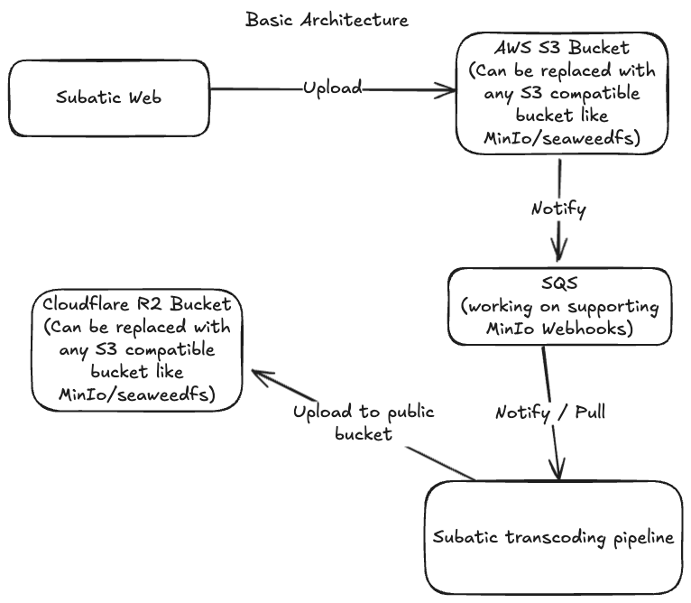

The most affordable solution for hosting your videos.

[Read the origin story on how we reduced our streaming cost by 99.46%](https://subatic.com/story)



## Docker Compose Deployment

We provide a `docker-compose.yml` file for easy deployment of Subatic, Subatic Transcoder, MinIo and PostgreSQL. To use it:

1. Create a `.env` file (use .env.example) in the same directory as your `docker-compose.yml` file.
2. Add all the required environment variables (listed below) to the `.env` file.
3. Run the following command to start the services:

   ```
   docker-compose up -d
   ```

The Docker Compose file includes health checks and proper service dependencies to ensure a smooth startup process.

## Detailed Setup Instructions

Follow these steps to get started:

1. **Create an AWS S3 Compatible Bucket**  
   Alternatively, you can use the MinIO container in `docker-compose`.

2. **(Optional) Connect the S3 Bucket to SQS**  
   If you want to use SQS, refer to the [AWS Documentation](https://docs.aws.amazon.com/AmazonS3/latest/userguide/ways-to-add-notification-config-to-bucket.html) for guidance.

3. **Generate an API Key for the S3 Bucket**  
   (Optional: The key should also have access to SQS if you followed step 2.) Ensure it has permissions to access both the S3 bucket and SQS.

4. **Set Up a PostgreSQL Database**

5. **Create Another S3 Bucket**  
   You can either create a new bucket or use the previous one.

6. **Generate API Keys for the Above Bucket**  
   (Optional: You can reuse the first key if applicable.)

7. **Make the Bucket Public**  
   Connect a domain / IP address to the bucket for public access.

8. **(Optional) Set CORS Policy if Using Cloudflare R2**  
   Use the following CORS configuration for your R2 bucket:

   ```json
   [
     {
       "AllowedOrigins": ["*"],
       "AllowedMethods": ["GET", "HEAD"],
       "AllowedHeaders": ["range"],
       "ExposeHeaders": ["Content-Type", "Access-Control-Allow-Origin", "ETag"],
       "MaxAgeSeconds": 3600
     }
   ]
   ```

9. **(Optional) Enable Caching in Cloudflare**  
   Refer to the [Cloudflare Documentation](https://developers.cloudflare.com/cache/how-to/cache-rules/create-dashboard/) and [this guide](https://developers.cloudflare.com/cache/how-to/cache-rules/examples/cache-everything/) on how to enable caching for your public domain connected to R2.

10. **Set Up the Transcoding Pipeline**  
    Refer to the [Transcoding Repository](https://github.com/orthdron/subatic-transcoding) for instructions.

11. **Deploy Your Application**  
    During deployment, ensure you set the environment variables listed below.

### Environment Variables

Make sure to set the following environment variables in your `.env` file:

#### For Subatic

```plaintext
DATABASE_URL=                     # Connection string for your PostgreSQL database

# Primary upload location
RAWFILES_S3_ACCESS_KEY_ID=<your_aws_access_key_id>
RAWFILES_S3_SECRET_ACCESS_KEY=<your_aws_secret_access_key>
RAWFILES_S3_REGION=<your_aws_region>
RAWFILES_S3_BUCKET=<your_bucket_name>
RAWFILES_S3_ENDPOINT=<custom_endpoint>
# In Megabytes
MAX_FILE_SIZE=<max_file_size_in_mb>
# Final upload location url
PROCESSED_VIDEO_URL=             # public S3 domain where final transcoded videos are stored
WEBHOOK_TOKEN=                    # Random Token for webhook notifications. Shared between this and transcoder.
# Optional variables

ENABLE_UMAMI="true"               # Enable / Disable Umami analytics
UMAMI_URL=<umami-hosted-url>      # URL of your Umami instance
UMAMI_ID=<data-website-id_from_umami>  # Website ID from Umami for tracking

ENABLE_PLAUSIBLE="false"          # Enable / Disable Plausible analytics
PLAUSIBLE_HOST=<plausible-hosted-url>  # URL of your Plausible instance
PLAUSIBLE_DOMAIN=<your-domain>    # Your domain for tracking with Plausible

ENABLE_GOOGLE_ANALYTICS="false"   # Enable / Disable Google Analytics
GOOGLE_ANALYTICS_ID=<ga-id>       # Your Google Analytics tracking ID
```

#### For Subatic-Transcoder

```plaintext
# Enable or disable SQS
SQS_ENABLED=false
SQS_URL=YOUR_SQS_URL

# Download bucket configuration
RAWFILES_S3_ACCESS_KEY_ID=http://localhost:9000
RAWFILES_S3_SECRET_ACCESS_KEY=YOUR_RAWFILES_S3_ACCESS_KEY_ID
RAWFILES_S3_SECRET_ACCESS_KEY=YOUR_DOWNLOAD_S3_SECRET_ACCESS_KEY
RAWFILES_S3_REGION=YOUR_DOWNLOAD_S3_REGION
RAWFILES_S3_BUCKET=YOUR_DOWNLOAD_BUCKET_NAME

# Upload bucket configuration: Can be same as download if public
PROCESSED_S3_ACCESS_KEY_ID=YOUR_PROCESSED_S3_ACCESS_KEY_ID
PROCESSED_S3_SECRET_ACCESS_KEY=YOUR_PROCESSED_S3_SECRET_ACCESS_KEY
PROCESSED_S3_REGION=YOUR_PROCESSED_S3_REGION
PROCESSED_S3_BUCKET=YOUR_UPLOAD_BUCKET_NAME
PROCESSED_S3_ENDPOINT=YOUR_PROCESSED_S3_ENDPOINT

# Webhook configuration
WEBHOOK_URL=http://localhost:3000/
WEBHOOK_TOKEN=YOUR_WEBHOOK_TOKEN
MARK_FAILED_AFTER=600 # time after which a processing video is marked as failed, and moved to queue
```

#### For PostgreSQL

```plaintext
POSTGRES_USER=postgres
POSTGRES_PASSWORD=                # Your PostgreSQL password
```

#### For MinIO

```plaintext
MINIO_ACCESS_KEY=                 # Your MinIO access key
MINIO_SECRET_KEY=                 # Your MinIO secret key
```

Replace the empty values with your actual configuration details.

More detailed documentation will be available soon. For any bugs, please report them using GitHub Issues.

If you have questions, feel free to reach out:

- [Contact on X](https://x.com/orthdron)
